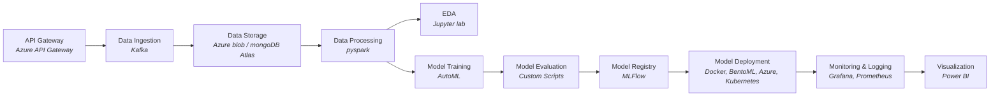

# Fraud Detection Using Machine Learning

## Architecture Overview
1. **API Gateway**: Entry point for all client requests.
2. **Data Ingestion Service**: Handles data ingestion using Kafka.
3. **Data Storage**: Stores raw data in a data lake (e.g., HDFS or S3).
4. **Data Processing Service**: Uses PySpark for data preprocessing and Redis/Apache Ignite for in-memory data handling.
5. **EDA Service**: Jupyter Notebooks for exploratory data analysis.
6. **Model Training Service**: Incorporates AutoML for automated model selection and training.
7. **Model Evaluation Service**: Evaluates models based on recall, precision, F1-score, and AUPRC.
8. **Model Registry Service**: Manages model versions using MLflow.
9. **Model Deployment Service**: Deploys models using Docker, BentoML/FastAPI, and integrates with CI/CD tools like CircleCI and Azure.
10. **Monitoring and Logging Service**: Monitors the system using Grafana and Prometheus.
11. **Visualization Service**: Uses Power BI for visualization of results and insights.

## Architecture Diagram

## High-Level Design (HLD)

### API Gateway

- **Responsibilities**: Routing, authentication, rate limiting.
- **Technologies**: Kong, NGINX, or AWS API Gateway.

### Data Ingestion Service

- **Responsibilities**: Collects and streams data to the data lake.
- **Technologies**: Apache Kafka.

### Data Storage

- **Responsibilities**: Stores raw and processed data.
- **Technologies**: HDFS, S3.

### Data Processing Service

- **Responsibilities**: Preprocesses data, handles feature engineering.
- **Technologies**: PySpark, Redis/Apache Ignite for in-memory processing.

### EDA Service

- **Responsibilities**: Provides interactive analysis of data.
- **Technologies**: Jupyter Notebook.

### Model Training Service

- **Responsibilities**: Automates model selection, training, and hyperparameter tuning using AutoML.
- **Technologies**: H2O.ai, Google AutoML, AutoKeras.

### Model Evaluation Service

- **Responsibilities**: Evaluates model performance.
- **Technologies**: Custom scripts, Scikit-learn metrics.

### Model Registry Service

- **Responsibilities**: Tracks and manages model versions.
- **Technologies**: MLflow.

### Model Deployment Service

- **Responsibilities**: Deploys models as microservices.
- **Technologies**: Docker, BentoML/FastAPI, CircleCI, Azure.

### Monitoring and Logging Service

- **Responsibilities**: Monitors system health, logs metrics.
- **Technologies**: Grafana, Prometheus.

### Visualization Service

- **Responsibilities**: Creates dashboards and reports.
- **Technologies**: Power BI.


## Low-Level Design (LLD)

### API Gateway

- **Endpoints**: Define REST endpoints for data submission, model predictions.
- **Security**: Implement JWT for authentication, API rate limiting policies.

### Data Ingestion Service

- **Producer Configuration**: Set up Kafka producers to stream data.
- **Topic Management**: Define Kafka topics for different data streams.

### Data Storage

- **Bucket Management**: Create S3 buckets or HDFS directories for storing raw data.
- **Data Partitioning**: Implement partitioning strategies for efficient storage and retrieval.

### Data Processing Service

- **Spark Jobs**: Write PySpark jobs for data cleaning, transformation, and feature engineering.
- **Caching**: Use Redis/Apache Ignite for intermediate data caching.

### EDA Service

- **Notebook Configuration**: Set up Jupyter notebooks with necessary libraries.
- **Data Access**: Provide secure access to processed data for analysis.

### Model Training Service

- **AutoML Pipeline**: Implement AutoML pipelines for automated model selection and hyperparameter tuning.
- **Hyperparameter Optimization**: Utilize AutoML tools to automate the optimization process.

### Model Evaluation Service

- **Evaluation Scripts**: Write scripts to compute recall, precision, F1-score, AUPRC.
- **Visualization**: Plot performance metrics using matplotlib/seaborn.

### Model Registry Service

- **MLflow Setup**: Configure MLflow for model tracking.
- **Versioning**: Implement version control for models.

### Model Deployment Service

- **Dockerization**: Create Docker images for model services.
- **CI/CD Pipelines**: Set up CircleCI pipelines for continuous deployment to Azure.

### Monitoring and Logging Service

- **Prometheus Config**: Configure Prometheus to scrape metrics.
- **Grafana Dashboards**: Create dashboards for monitoring key metrics.

### Visualization Service

- **Data Pipelines**: Set up ETL pipelines to feed data into Power BI.
- **Dashboard Design**: Design interactive dashboards for data visualization.


## Repository Structure
```
Fraud-Detection-Using-Machine-Learning/
│
├── data/                           # Data directory
│   ├── raw/                        # Raw data (e.g., CSV files, logs)
│   ├── processed/                  # Processed data (after ETL pipelines)
│   ├── models/                     # Trained models
│   └── ...
│
├── notebooks/                      # Jupyter Notebooks for EDA and analysis
│   ├── exploratory_analysis.ipynb  # Initial data exploration
│   ├── data_preprocessing.ipynb    # Data preprocessing steps
│   └── ...
│
├── src/                            # Source code directory
│   ├── api/                        # API implementation (FastAPI, Flask)
│   ├── data_processing/            # Data processing scripts (PySpark, Pandas)
│   ├── model_training/             # Model training scripts (AutoML, Scikit-learn)
│   ├── model_evaluation/           # Model evaluation scripts
│   ├── model_deployment/           # Model deployment scripts (Docker, Kubernetes)
│   ├── utils/                      # Utility functions
│   └── ...
│
├── tests/                          # Unit tests and integration tests
│   ├── test_data_processing.py     # Tests for data processing
│   ├── test_model_training.py      # Tests for model training
│   ├── test_api.py                 # Tests for API endpoints
│   └── ...
│
├── config/                         # Configuration files
│   ├── config.yaml                 # General configurations
│   ├── mlflow.yaml                 # MLflow configurations
│   ├── dockerfile                  # Docker configurations
│   └── ...
│
├── docs/                           # Documentation directory
│   ├── architecture.md             # System architecture documentation
│   ├── api_reference.md            # API reference documentation
│   ├── data_dictionary.md          # Data dictionary
│   └── ...
│
├── requirements.txt                # Python dependencies
├── README.md                       # Project README file
├── LICENSE                         # License information
└── .gitignore                      # Git ignore file
```

Fraud-Detection-Using-Machine-Learning/
│
├── data/                          
│   ├── raw/                        
│   ├── processed/                 
│   ├── models/                     
│   └── ...
│
├── notebooks/                      
│   ├── eda.ipynb  
│   ├── preprocessing.ipynb    
│
├── src/                           
│   ├── fraud_prediction/                        
│       ├── entity/
│       |   ├── config_entity.py
│       |   ├── ...
|       |
│       ├── artifacts/
│       |   ├── model.pkl
│       |   ├── preprocessing.pkl
│       |   ├── ...
|       |
│       ├── component/
│       |   ├── data_ingestion.py
│       |   ├── data_validation.py
│       |   ├── data_transformation.py
│       |   ├── model_trainer.py
│       |   ├── model_evaluation.py
│       |   ├── model_pusher.py
|       |
│       ├── config/
│       |   ├── azure_connection.py
│       |   ├── kafka_connection.py
│       |   ├── pyspark_manager.py
│       |   ├── mongo_client.py
│       |   ├── ...
|       |           
│       ├── constant/
│       |   ├── database/
│       |   ├── environment/
│       |   ├── model/
│       |   ├── prediction_pipeline_config/
│       |   ├── training_pipeline_config/
│       |   ├── ...
|       |
│       ├── templates/
│       |   ├── index.html
│       |   ├── ...
│       |  
│       ├── utils/
│       |   ├── utils.py
│       |  
│       ├── app.py
│       ├── exception.py
│       ├── logger.py                  
│       └── ...
│
├── tests/                         
│   ├── test_data_processing.py     
│   ├── test_model_training.py      
│   ├── test_api.py                
│   └── ...
│
├── config/                        
│   ├── config.yaml                
│   ├── mlflow.yaml                 
│   ├── dockerfile                  
│   └── ...
│
├── docs/                           
│   ├── architecture.md            
│   ├── api_reference.md            
│   ├── data_dictionary.md          
│
├── flowcharts/
│   ├── data_ingestion.md     
│   ├── data_validation.md         
│   ├── data_transformation.md         
│   ├── model_trainer.md
│   ├── model_evaluation.md         
│   ├── model_pusher.md
│   ├── training_pipeline.md
│   ├── prediction_pipeline.md
|
├── setup.py
├── start.sh
├── Dockerfile
├── Docker-compose.yaml
├── .dockerignore
├── requirements.txt               
├── README.md                      
├── LICENSE                        
└── .gitignore                     

